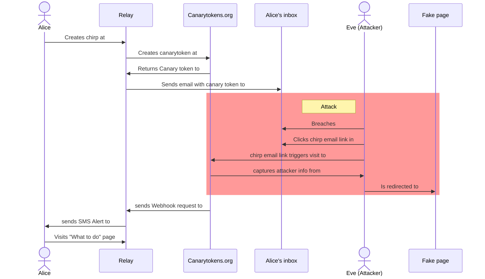

```mermaid
sequenceDiagram
    actor Alice
    Alice->>Relay: Creates chirp at
    Relay->>Canarytokens.org: Creates canarytoken at
    Canarytokens.org->>Relay: Returns Canary token to
    Relay->>Alice's inbox: Sends email with canary token to

    rect rgba(255, 0, 0, .4)
        actor Eve (Attacker)
        note left of Eve (Attacker): Attack
        Eve (Attacker)->>Alice's inbox: Breaches
        Eve (Attacker)->>Alice's inbox: Clicks chirp email link in
        Eve (Attacker)->>Canarytokens.org: chirp email link triggers visit to
        Canarytokens.org->>Eve (Attacker): captures attacker info from
        Eve (Attacker)->>Fake page: Is redirected to
    end
    Canarytokens.org->>Relay: sends Webhook request to
    Relay->>Alice: sends SMS Alert to
    Alice->>Relay: Visits "What to do" page
```
